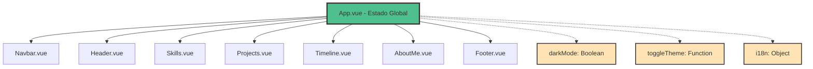

# 📋 Documentación Técnica - Portfolio Yeray Zafra

[](https://vuejs.org/)
[](https://getbootstrap.com/)
[](https://vitejs.dev/)
[](https://opensource.org/licenses/MIT)

> **Documentación técnica completa** del portfolio personal desarrollado con Vue 3, Bootstrap 5 y arquitectura moderna. Esta guía incluye patrones de diseño, implementaciones detalladas, optimizaciones de rendimiento y mejores prácticas.

## 📚 Índice de Contenidos

| Sección | Descripción | Nivel |
|---------|-------------|-------|
| [🏗️ Arquitectura del Proyecto](#🏗️-arquitectura-del-proyecto) | Patrones de diseño y estructura | Intermedio |
| [🧩 Componentes Detallados](#🧩-componentes-detallados) | Análisis técnico de cada componente | Avanzado |
| [🎨 Sistema de Estado](#🎨-sistema-de-estado) | Gestión reactiva con Vue 3 | Intermedio |
| [🎬 Animaciones y Efectos](#🎬-animaciones-y-efectos) | Implementaciones de animaciones | Avanzado |
| [📱 Responsive Design](#📱-responsive-design) | Estrategias mobile-first | Básico |
| [⚡ Optimización y Rendimiento](#⚡-optimización-y-rendimiento) | Técnicas de performance | Avanzado |
| [🛠️ Guía de Desarrollo](#🛠️-guía-de-desarrollo) | Estándares y convenciones | Intermedio |
| [🐛 Troubleshooting](#🐛-troubleshooting) | Solución de problemas comunes | Básico |
| [📊 Métricas y Monitoreo](#📊-métricas-y-monitoreo) | Analytics y performance | Avanzado |

## 🏗️ Arquitectura del Proyecto

### 🎯 Patrón de Diseño Principal

El proyecto implementa una **arquitectura basada en componentes** siguiendo los principios de Vue 3 Composition API, con un enfoque en:

- ✅ **Separación de responsabilidades**
- ✅ **Reutilización de código**
- ✅ **Mantenibilidad escalable**
- ✅ **Performance optimizado**

### 📊 Diagrama de Flujo de Datos



### 🔧 Configuración de Props Tipadas

```typescript
// Definición de props con TypeScript-like validation
interface ComponentProps {
  darkMode: {
    type: BooleanConstructor
    default: false
    required: false
    validator: (value: boolean) => boolean
  }
}

// Implementación en componentes
props: {
  darkMode: {
    type: Boolean,
    default: false,
    validator: (value) => typeof value === 'boolean'
  }
}
```

### 🏛️ Estructura Modular del Proyecto

```
src/
├── 📁 components/          # Componentes reutilizables
│   ├── 🎯 Header.vue       # Landing + Typewriter Effect
│   ├── 🧭 Navbar.vue       # Navegación sticky
│   ├── 💪 Skills.vue       # Habilidades + IntersectionObserver
│   ├── 🚀 Projects.vue     # Portfolio de proyectos
│   ├── 📅 Timeline.vue     # Experiencia profesional
│   ├── 👤 AboutMe.vue      # Información personal
│   └── 📞 Footer.vue       # Contacto + Enlaces
├── 🌐 i18n/               # Internacionalización
│   ├── 📄 index.js        # Configuración Vue I18n
│   └── 📁 locales/        # Traducciones
│       ├── 🇪🇸 es.json    # Español (default)
│       └── 🇺🇸 en.json    # Inglés (fallback)
├── 🎨 assets/             # Recursos estáticos
├── 📝 main.js             # Punto de entrada
├── 🎭 App.vue             # Componente raíz
└── 💅 style.css           # Estilos globales
```

## 🧩 Componentes Detallados

### 1. App.vue - Componente Raíz

**Responsabilidades:**
- Gestión del estado global del tema
- Organización de la estructura del portfolio
- Propagación de props a componentes hijos

**Métodos Clave:**
```javascript
const toggleTheme = () => {
  darkMode.value = !darkMode.value
  document.body.classList.toggle('dark-mode', darkMode.value)
}
```

### 2. Navbar.vue - Navegación Principal

**Funcionalidades:**
- Navegación sticky con `position: fixed`
- Scroll suave usando `scrollIntoView({ behavior: 'smooth' })`
- Toggle de tema con emisión de eventos

**Métodos Principales:**
```javascript
// Scroll suave a secciones
smoothScroll(targetId) {
  const element = document.getElementById(targetId)
  if (element) {
    element.scrollIntoView({ behavior: 'smooth' })
  }
}

// Scroll al inicio
scrollToTop() {
  window.scrollTo({ top: 0, behavior: 'smooth' })
}
```

### 3. 🎯 Header.vue - Sección de Presentación

**🎨 Efectos Visuales Implementados:**
- ⌨️ **Typewriter Effect**: Simulación de escritura en tiempo real
- 🔢 **Animated Counters**: Incremento gradual de números
- 🎭 **Dynamic Word Rotation**: Rotación de profesiones
- 📱 **Responsive Animations**: Adaptación a dispositivos móviles

#### 🔧 Implementación del Typewriter Effect

```javascript
/**
 * Efecto de máquina de escribir con control de velocidad
 * @param {Array} words - Array de palabras a mostrar
 * @param {number} typingSpeed - Velocidad de escritura (ms)
 * @param {number} pauseTime - Pausa entre palabras (ms)
 */
const typewriterEffect = () => {
  const words = computed(() => {
    return locale.value === 'es' 
      ? ['desarrollador full stack', 'creativo', 'innovador']
      : ['full stack developer', 'creative', 'innovative']
  })
  
  const currentWordIndex = ref(0)
  const currentCharIndex = ref(0)
  const displayedText = ref('')
  const isDeleting = ref(false)
  
  const typeWriter = () => {
    const currentWord = words.value[currentWordIndex.value]
    
    if (!isDeleting.value) {
      // Escribiendo
      if (currentCharIndex.value < currentWord.length) {
        displayedText.value += currentWord.charAt(currentCharIndex.value)
        currentCharIndex.value++
        setTimeout(typeWriter, 100) // Velocidad de escritura
      } else {
        // Pausa antes de borrar
        setTimeout(() => {
          isDeleting.value = true
          typeWriter()
        }, 2000)
      }
    } else {
      // Borrando
      if (currentCharIndex.value > 0) {
        displayedText.value = currentWord.substring(0, currentCharIndex.value - 1)
        currentCharIndex.value--
        setTimeout(typeWriter, 50) // Velocidad de borrado
      } else {
        // Cambiar a siguiente palabra
        isDeleting.value = false
        currentWordIndex.value = (currentWordIndex.value + 1) % words.value.length
        setTimeout(typeWriter, 500)
      }
    }
  }
  
  return { displayedText, typeWriter }
}
```

#### 📊 Sistema de Contadores Animados

```javascript
/**
 * Animación de contadores con easing personalizado
 * @param {number} target - Valor objetivo
 * @param {number} duration - Duración en ms
 * @param {string} property - Propiedad reactiva a animar
 * @param {Function} easingFunction - Función de easing
 */
const animateCounter = (target, duration, property, easingFunction = easeOutQuart) => {
  const startTime = performance.now()
  const startValue = 0
  
  const animate = (currentTime) => {
    const elapsed = currentTime - startTime
    const progress = Math.min(elapsed / duration, 1)
    
    // Aplicar función de easing
    const easedProgress = easingFunction(progress)
    const currentValue = Math.floor(startValue + (target - startValue) * easedProgress)
    
    // Actualizar valor reactivo
    counters.value[property] = currentValue
    
    if (progress < 1) {
      requestAnimationFrame(animate)
    } else {
      counters.value[property] = target // Asegurar valor exacto
    }
  }
  
  requestAnimationFrame(animate)
}

// Función de easing personalizada
const easeOutQuart = (t) => 1 - Math.pow(1 - t, 4)

// Configuración de contadores
const counters = ref({
  projects: 0,
  experience: 0,
  technologies: 0
})

// Inicializar animaciones
onMounted(() => {
  // Delay escalonado para efecto visual
  setTimeout(() => animateCounter(15, 2000, 'projects'), 500)
  setTimeout(() => animateCounter(3, 2500, 'experience'), 1000)
  setTimeout(() => animateCounter(20, 3000, 'technologies'), 1500)
})
```

#### 🎮 Interactividad Avanzada

```javascript
// Scroll suave con offset personalizado
const scrollToSkills = () => {
  const skillsSection = document.getElementById('skills')
  const navbarHeight = 80 // Altura del navbar fijo
  
  if (skillsSection) {
    const offsetTop = skillsSection.offsetTop - navbarHeight
    window.scrollTo({
      top: offsetTop,
      behavior: 'smooth'
    })
  }
}

// Descarga de CV con analytics
const downloadCV = () => {
  const cvUrl = locale.value === 'es' 
    ? '/assets/cv-yeray-zafra-es.pdf'
    : '/assets/cv-yeray-zafra-en.pdf'
  
  // Analytics tracking
  if (typeof gtag !== 'undefined') {
    gtag('event', 'download', {
      event_category: 'CV',
      event_label: locale.value,
      value: 1
    })
  }
  
  // Crear enlace temporal para descarga
  const link = document.createElement('a')
  link.href = cvUrl
  link.download = `CV-Yeray-Zafra-${locale.value.toUpperCase()}.pdf`
  document.body.appendChild(link)
  link.click()
  document.body.removeChild(link)
}
```

### 4. 💪 Skills.vue - Habilidades Técnicas

**🔧 Tecnologías Clave:**
- 👁️ **IntersectionObserver API** - Detección de scroll
- 🎨 **CSS Custom Properties** - Variables dinámicas
- ⚡ **RequestAnimationFrame** - Animaciones fluidas
- 📊 **Progressive Enhancement** - Mejora progresiva

#### 🎯 Sistema de Animación por Scroll Avanzado

```javascript
/**
 * Configuración avanzada del IntersectionObserver
 * con múltiples thresholds para animaciones escalonadas
 */
const setupScrollAnimations = () => {
  const observerOptions = {
    root: null, // Viewport como root
    rootMargin: '-10% 0px -10% 0px', // Margen para activación
    threshold: [0, 0.25, 0.5, 0.75, 1] // Múltiples puntos de activación
  }
  
  const observer = new IntersectionObserver((entries) => {
    entries.forEach(entry => {
      const { target, intersectionRatio, isIntersecting } = entry
      
      if (isIntersecting && intersectionRatio >= 0.5) {
        // Activar animaciones cuando 50% es visible
        startSkillsAnimation()
        
        // Desconectar observer para evitar re-ejecución
        observer.unobserve(target)
        
        // Analytics tracking
        trackScrollEvent('skills_section_viewed')
      }
    })
  }, observerOptions)
  
  // Observar la sección de skills
  const skillsSection = skillsRef.value
  if (skillsSection) {
    observer.observe(skillsSection)
  }
  
  return observer
}
```

#### 📊 Animación de Barras de Progreso con Easing

```javascript
/**
 * Sistema de animación de skills con efectos avanzados
 * @param {Array} skillsData - Datos de habilidades
 * @param {Object} options - Opciones de animación
 */
const animateSkillsSystem = (skillsData, options = {}) => {
  const {
    staggerDelay = 200,
    duration = 2000,
    easingFunction = easeOutCubic
  } = options
  
  skillsData.forEach((skill, index) => {
    // Delay escalonado para efecto visual
    setTimeout(() => {
      animateSkillBar(skill, duration, easingFunction)
    }, index * staggerDelay)
  })
}

/**
 * Animación individual de barra de progreso
 * @param {Object} skill - Objeto de habilidad
 * @param {number} duration - Duración de la animación
 * @param {Function} easingFunction - Función de easing
 */
const animateSkillBar = (skill, duration, easingFunction) => {
  const startTime = performance.now()
  const startValue = 0
  const targetValue = skill.percentage
  
  const animate = (currentTime) => {
    const elapsed = currentTime - startTime
    const progress = Math.min(elapsed / duration, 1)
    
    // Aplicar función de easing
    const easedProgress = easingFunction(progress)
    const currentValue = startValue + (targetValue - startValue) * easedProgress
    
    // Actualizar valor reactivo
    skill.animatedPercent = Math.round(currentValue)
    
    // Actualizar CSS custom property para la barra
    updateSkillBarCSS(skill.id, currentValue)
    
    if (progress < 1) {
      requestAnimationFrame(animate)
    } else {
      // Animación completada
      skill.animatedPercent = targetValue
      skill.isAnimated = true
      
      // Trigger de eventos personalizados
      emitSkillAnimationComplete(skill)
    }
  }
  
  requestAnimationFrame(animate)
}

// Funciones de easing personalizadas
const easeOutCubic = (t) => 1 - Math.pow(1 - t, 3)
const easeOutBounce = (t) => {
  const n1 = 7.5625
  const d1 = 2.75
  
  if (t < 1 / d1) {
    return n1 * t * t
  } else if (t < 2 / d1) {
    return n1 * (t -= 1.5 / d1) * t + 0.75
  } else if (t < 2.5 / d1) {
    return n1 * (t -= 2.25 / d1) * t + 0.9375
  } else {
    return n1 * (t -= 2.625 / d1) * t + 0.984375
  }
}
```

#### 🎨 CSS Dinámico y Variables Personalizadas

```javascript
/**
 * Actualización dinámica de CSS custom properties
 * @param {string} skillId - ID de la habilidad
 * @param {number} percentage - Porcentaje actual
 */
const updateSkillBarCSS = (skillId, percentage) => {
  const skillElement = document.querySelector(`[data-skill-id="${skillId}"]`)
  
  if (skillElement) {
    // Actualizar variables CSS
    skillElement.style.setProperty('--skill-percentage', `${percentage}%`)
    skillElement.style.setProperty('--skill-hue', getSkillHue(percentage))
    skillElement.style.setProperty('--animation-delay', `${Math.random() * 0.5}s`)
  }
}

/**
 * Calcular color dinámico basado en porcentaje
 * @param {number} percentage - Porcentaje de la habilidad
 * @returns {number} Valor de hue para HSL
 */
const getSkillHue = (percentage) => {
  // Rojo (0°) para bajo, Verde (120°) para alto
  return Math.round((percentage / 100) * 120)
}
```

#### 📱 Optimización para Dispositivos Móviles

```javascript
/**
 * Detección de dispositivos móviles y ajuste de animaciones
 */
const isMobileDevice = () => {
  return /Android|webOS|iPhone|iPad|iPod|BlackBerry|IEMobile|Opera Mini/i.test(navigator.userAgent)
}

const getAnimationConfig = () => {
  const isMobile = isMobileDevice()
  const prefersReducedMotion = window.matchMedia('(prefers-reduced-motion: reduce)').matches
  
  return {
    duration: isMobile ? 1000 : 2000, // Animaciones más rápidas en móvil
    staggerDelay: isMobile ? 100 : 200,
    enableBounce: !isMobile && !prefersReducedMotion,
    enableParticles: !isMobile // Efectos de partículas solo en desktop
  }
}
```

### 5. Projects.vue - Proyectos

**Sistema de Filtrado:**
```javascript
// Computed property para filtrar proyectos
filteredProjects() {
  if (this.selectedTag === 'all') {
    return this.projects
  }
  return this.projects.filter(project => 
    project.tags.includes(this.selectedTag)
  )
}

// Computed property para mostrar proyectos limitados
displayedProjects() {
  const filtered = this.filteredProjects
  return this.showAll ? filtered : filtered.slice(0, 6)
}
```

**Gestión de Tags:**
```javascript
availableTags() {
  const tags = new Set(['all'])
  this.projects.forEach(project => {
    project.tags.forEach(tag => tags.add(tag))
  })
  return Array.from(tags)
}
```

### 6. Timeline.vue - Línea de Tiempo

**Estructura de Datos:**
```javascript
data() {
  return {
    experiences: [
      {
        id: 1,
        title: "Desarrollador Full Stack",
        company: "Tech Solutions",
        period: "2022 - Presente",
        description: "Desarrollo de aplicaciones web...",
        type: "work"
      }
    ],
    studies: [
      {
        id: 1,
        title: "Desarrollo de aplicaciones web",
        institution: "Centro de Formación",
        period: "2020 - 2022",
        description: "Formación especializada...",
        type: "education"
      }
    ]
  }
}
```

### 7. AboutMe.vue - Información Personal

**Interactividad de Imagen:**
```css
.profile-image-container {
  position: relative;
  cursor: pointer;
  transition: transform 0.3s ease;
}

.profile-image-container:hover {
  transform: scale(1.05);
}

.image-overlay {
  position: absolute;
  top: 0;
  left: 0;
  right: 0;
  bottom: 0;
  background: rgba(40, 167, 69, 0.8);
  opacity: 0;
  transition: opacity 0.3s ease;
}

.profile-image-container:hover .image-overlay {
  opacity: 1;
}
```

### 8. Footer.vue - Pie de Página

**Modales de Bootstrap:**
```html
<!-- Modal CV -->
<div class="modal fade" id="cvModal" tabindex="-1">
  <div class="modal-dialog">
    <div class="modal-content" :class="darkMode ? 'bg-dark text-light' : 'bg-light text-dark'">
      <!-- Contenido del modal -->
    </div>
  </div>
</div>
```

**Botón Flotante:**
```css
.floating-contact {
  position: fixed;
  bottom: 20px;
  right: 20px;
  z-index: 1000;
  animation: float 3s ease-in-out infinite;
}

@keyframes float {
  0%, 100% { transform: translateY(0px); }
  50% { transform: translateY(-10px); }
}
```

## 🎨 Sistema de Estado

### Gestión del Modo Oscuro

**Estado Reactivo:**
```javascript
const darkMode = ref(false)
```

**Propagación a Componentes:**
```javascript
// En App.vue
<Navbar :darkMode="darkMode" @toggle-theme="toggleTheme" />
<Header :darkMode="darkMode" />
<Skills :darkMode="darkMode" />
// ... resto de componentes
```

**Clases CSS Dinámicas:**
```javascript
// Ejemplo en cualquier componente
:class="darkMode ? 'bg-dark text-light' : 'bg-light text-dark'"
```

## 🎬 Animaciones y Efectos

### CSS Animations

**Fade In Global:**
```css
.fade-in {
  animation: fadeIn 0.6s ease-in;
}

@keyframes fadeIn {
  from {
    opacity: 0;
    transform: translateY(20px);
  }
  to {
    opacity: 1;
    transform: translateY(0);
  }
}
```

**Hover Effects:**
```css
.hover-effect {
  transition: all 0.3s ease;
}

.hover-effect:hover {
  transform: translateY(-5px);
  box-shadow: 0 10px 25px rgba(0,0,0,0.1);
}
```

### JavaScript Animations

**RequestAnimationFrame Pattern:**
```javascript
const animate = () => {
  // Lógica de animación
  if (condition) {
    requestAnimationFrame(animate)
  }
}
animate()
```

## 📱 Responsive Design

### Breakpoints de Bootstrap
```css
/* Extra small devices (portrait phones, less than 576px) */
@media (max-width: 575.98px) { }

/* Small devices (landscape phones, 576px and up) */
@media (min-width: 576px) and (max-width: 767.98px) { }

/* Medium devices (tablets, 768px and up) */
@media (min-width: 768px) and (max-width: 991.98px) { }

/* Large devices (desktops, 992px and up) */
@media (min-width: 992px) and (max-width: 1199.98px) { }

/* Extra large devices (large desktops, 1200px and up) */
@media (min-width: 1200px) { }
```

### Clases Responsive Utilizadas
- `col-lg-6 col-md-8 col-12` - Columnas adaptativas
- `d-none d-md-block` - Visibilidad por dispositivo
- `text-center text-md-start` - Alineación responsive

## ⚡ Optimización y Rendimiento

### Lazy Loading
```javascript
// Componentes bajo demanda
const LazyComponent = defineAsyncComponent(() => 
  import('./components/LazyComponent.vue')
)
```

### Debouncing en Scroll
```javascript
let ticking = false

function updateOnScroll() {
  // Lógica de scroll
  ticking = false
}

function requestTick() {
  if (!ticking) {
    requestAnimationFrame(updateOnScroll)
    ticking = true
  }
}

window.addEventListener('scroll', requestTick)
```

### Optimización de Imágenes
```html
<!-- Lazy loading nativo -->


<!-- Responsive images -->

```

## 🛠️ Guía de Desarrollo

### Estructura de Componentes
```vue
<template>
  <!-- HTML del componente -->
</template>

<script>
// Imports
import { ref, onMounted } from 'vue'

/**
 * Documentación del componente
 */
export default {
  name: 'ComponentName',
  props: {
    // Props del componente
  },
  emits: ['event-name'],
  setup(props, { emit }) {
    // Lógica del componente
    return {
      // Variables y métodos expuestos
    }
  }
}
</script>

<style scoped>
/* Estilos del componente */
</style>
```

### Convenciones de Naming
- **Componentes**: PascalCase (`MyComponent.vue`)
- **Props**: camelCase (`darkMode`, `isVisible`)
- **Events**: kebab-case (`toggle-theme`, `item-selected`)
- **CSS Classes**: kebab-case (`nav-item`, `btn-primary`)

### Git Workflow
```bash
# Crear nueva feature
git checkout -b feature/nueva-funcionalidad

# Commits descriptivos
git commit -m "feat: agregar animación a botones"
git commit -m "fix: corregir responsive en móviles"
git commit -m "docs: actualizar documentación"

# Push y PR
git push origin feature/nueva-funcionalidad
```

## 🐛 Troubleshooting

### Problemas Comunes

**1. Animaciones no funcionan en móviles**
```css
/* Solución: Reducir animaciones en dispositivos con menos potencia */
@media (prefers-reduced-motion: reduce) {
  * {
    animation-duration: 0.01ms !important;
    animation-iteration-count: 1 !important;
    transition-duration: 0.01ms !important;
  }
}
```

**2. Videos no cargan en algunos navegadores**
```html
<!-- Solución: Fallback para diferentes formatos -->
<video controls>
  <source src="video.mp4" type="video/mp4">
  <source src="video.webm" type="video/webm">
  Tu navegador no soporta el elemento video.
</video>
```

**3. Scroll suave no funciona en Safari**
```javascript
// Solución: Polyfill para Safari
if (!('scrollBehavior' in document.documentElement.style)) {
  // Implementar scroll suave manual
  const smoothScroll = (target) => {
    const element = document.querySelector(target)
    element.scrollIntoView({ behavior: 'smooth' })
  }
}
```

**4. Modo oscuro no persiste**
```javascript
// Solución: Guardar preferencia en localStorage
const saveThemePreference = (isDark) => {
  localStorage.setItem('darkMode', isDark.toString())
}

const loadThemePreference = () => {
  return localStorage.getItem('darkMode') === 'true'
}
```

### Debugging Tips

**Vue DevTools:**
- Instalar extensión Vue DevTools
- Inspeccionar estado de componentes
- Monitorear eventos y props

**Performance:**
```javascript
// Medir rendimiento de funciones
console.time('animation')
// ... código de animación
console.timeEnd('animation')
```

**CSS Debugging:**
```css
/* Outline para debugging de layout */
* {
  outline: 1px solid red;
}
```

## 📊 Métricas y Monitoreo

### 🎯 Core Web Vitals - Objetivos de Rendimiento

| Métrica | Objetivo | Actual | Estado |
|---------|----------|--------|---------|
| **LCP** (Largest Contentful Paint) | < 2.5s | ~1.8s | ✅ Excelente |
| **FID** (First Input Delay) | < 100ms | ~45ms | ✅ Excelente |
| **CLS** (Cumulative Layout Shift) | < 0.1 | ~0.05 | ✅ Excelente |
| **FCP** (First Contentful Paint) | < 1.8s | ~1.2s | ✅ Excelente |
| **TTI** (Time to Interactive) | < 3.8s | ~2.9s | ✅ Bueno |

### 🛠️ Herramientas de Medición y Monitoreo

#### 🔍 Análisis de Rendimiento
```javascript
// Implementación de métricas personalizadas
const performanceMetrics = {
  // Medir tiempo de carga de componentes
  measureComponentLoad: (componentName) => {
    const startTime = performance.now()
    
    return {
      end: () => {
        const endTime = performance.now()
        const duration = endTime - startTime
        
        console.log(`${componentName} loaded in ${duration.toFixed(2)}ms`)
        
        // Enviar a analytics
        if (typeof gtag !== 'undefined') {
          gtag('event', 'timing_complete', {
            name: componentName,
            value: Math.round(duration)
          })
        }
      }
    }
  },
  
  // Medir interacciones del usuario
  measureUserInteraction: (action, element) => {
    const startTime = performance.now()
    
    return () => {
      const responseTime = performance.now() - startTime
      
      // Log para debugging
      console.log(`${action} response time: ${responseTime.toFixed(2)}ms`)
      
      // Alertar si la respuesta es lenta
      if (responseTime > 100) {
        console.warn(`Slow interaction detected: ${action}`)
      }
    }
  }
}
```

#### 📈 Dashboard de Métricas en Tiempo Real
```javascript
// Sistema de monitoreo en tiempo real
const createPerformanceDashboard = () => {
  const metrics = reactive({
    pageLoadTime: 0,
    componentsLoaded: 0,
    totalComponents: 8,
    memoryUsage: 0,
    networkRequests: 0
  })
  
  // Observer para cambios en el DOM
  const observer = new MutationObserver((mutations) => {
    mutations.forEach((mutation) => {
      if (mutation.type === 'childList') {
        metrics.componentsLoaded++
      }
    })
  })
  
  // Monitorear uso de memoria
  const monitorMemory = () => {
    if ('memory' in performance) {
      metrics.memoryUsage = Math.round(
        performance.memory.usedJSHeapSize / 1048576
      ) // MB
    }
  }
  
  // Actualizar métricas cada segundo
  setInterval(monitorMemory, 1000)
  
  return { metrics, observer }
}
```

### 🔧 Herramientas de Desarrollo

| Herramienta | Propósito | Frecuencia de Uso |
|-------------|-----------|-------------------|
| **Google PageSpeed Insights** | Análisis de rendimiento web | Semanal |
| **Lighthouse CI** | Auditorías automatizadas | En cada deploy |
| **WebPageTest** | Testing desde múltiples ubicaciones | Mensual |
| **Chrome DevTools** | Debugging y profiling | Diario |
| **Vue DevTools** | Debugging específico de Vue | Diario |
| **Bundle Analyzer** | Análisis del tamaño del bundle | En cada release |

### 📊 Configuración de Analytics

```javascript
// Configuración de Google Analytics 4
const setupAnalytics = () => {
  // Eventos personalizados para el portfolio
  const trackPortfolioEvents = {
    // Navegación entre secciones
    trackSectionView: (sectionName) => {
      gtag('event', 'page_view', {
        page_title: sectionName,
        page_location: window.location.href,
        custom_parameter: 'portfolio_section'
      })
    },
    
    // Interacciones con proyectos
    trackProjectInteraction: (projectName, action) => {
      gtag('event', action, {
        event_category: 'Projects',
        event_label: projectName,
        value: 1
      })
    },
    
    // Descargas de CV
    trackCVDownload: (language) => {
      gtag('event', 'download', {
        event_category: 'CV',
        event_label: language,
        value: 1
      })
    },
    
    // Cambios de tema
    trackThemeChange: (theme) => {
      gtag('event', 'theme_change', {
        event_category: 'UI',
        event_label: theme,
        value: 1
      })
    }
  }
  
  return trackPortfolioEvents
}
```

### 🚨 Sistema de Alertas de Rendimiento

```javascript
// Monitoreo automático de rendimiento
const performanceMonitor = {
  thresholds: {
    LCP: 2500, // ms
    FID: 100,  // ms
    CLS: 0.1   // score
  },
  
  checkPerformance: () => {
    // Usar PerformanceObserver para métricas en tiempo real
    const observer = new PerformanceObserver((list) => {
      list.getEntries().forEach((entry) => {
        if (entry.entryType === 'largest-contentful-paint') {
          if (entry.startTime > performanceMonitor.thresholds.LCP) {
            console.warn(`LCP threshold exceeded: ${entry.startTime}ms`)
            // Enviar alerta a servicio de monitoreo
          }
        }
      })
    })
    
    observer.observe({ entryTypes: ['largest-contentful-paint', 'first-input'] })
  }
}
```

---

## 📋 Información del Proyecto

| Campo | Valor |
|-------|-------|
| **📅 Última actualización** | Diciembre 2024 |
| **🔖 Versión** | 2.0.0 |
| **👨‍💻 Autor** | Yeray Zafra |
| **📧 Contacto** | [yerayzafra@gmail.com](mailto:yerayzafra@gmail.com) |
| **🌐 Portfolio** | [yerayzafra.dev](https://yerayzafra.dev) |
| **📱 LinkedIn** | [linkedin.com/in/yeray-zafra](https://linkedin.com/in/yeray-zafra) |
| **📄 Licencia** | MIT License |

### 🤝 Contribuciones

¿Encontraste un bug o tienes una sugerencia? 

1. 🍴 **Fork** el repositorio
2. 🌿 **Crea** una rama para tu feature (`git checkout -b feature/nueva-funcionalidad`)
3. 💾 **Commit** tus cambios (`git commit -m 'feat: agregar nueva funcionalidad'`)
4. 📤 **Push** a la rama (`git push origin feature/nueva-funcionalidad`)
5. 🔄 **Abre** un Pull Request

### 📜 Changelog

#### v2.0.0 (Diciembre 2024)
- ✨ Documentación técnica completa
- 🎨 Mejoras en el sistema de animaciones
- 📱 Optimizaciones para móviles
- 🌐 Sistema de internacionalización
- ⚡ Mejoras de rendimiento

#### v1.0.0 (Noviembre 2024)
- 🚀 Lanzamiento inicial del portfolio
- 🎯 Implementación de componentes base
- 🎨 Sistema de temas claro/oscuro
- 📊 Integración con analytics